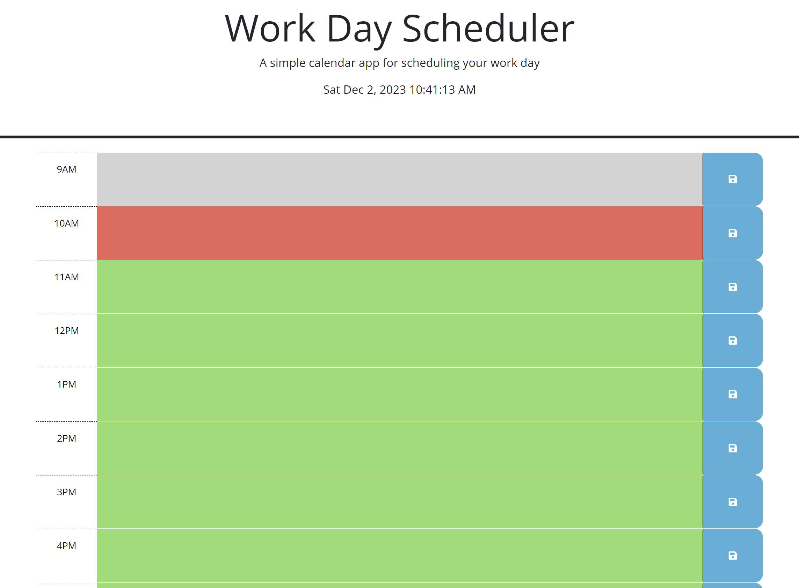
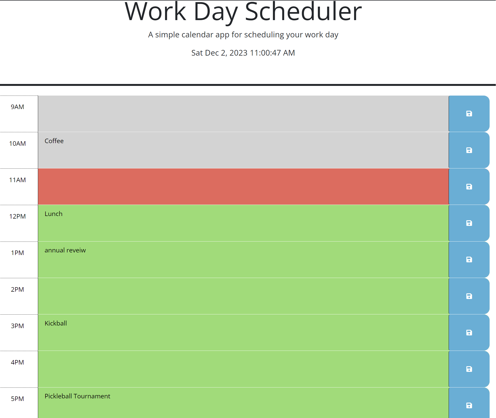
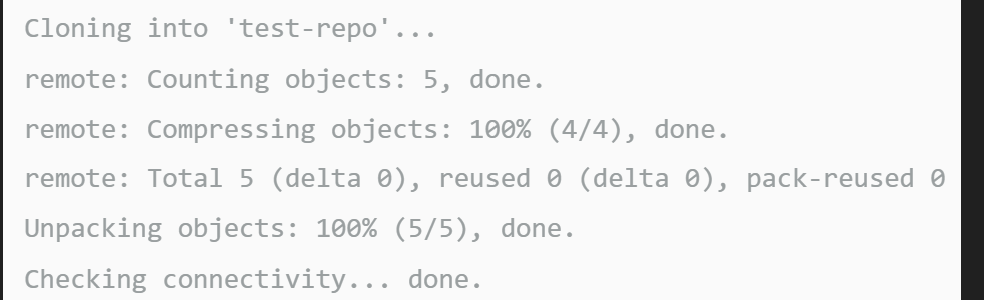

# SCHEDULER

## Description
  - This is a developed third-party API, work day scheduler. This app will be a simple calendar app that will allow you to save events/appointments/meetings for each hour of a typical working day. The purpose of this app is to be able to add important events/appointments/meetings to my daily planner. This will ensure I am able to manage my time to the best of my ability.

    * I have added two more skills to my tool box.
      *  Jquery
      *  Day.js

  ### User Story
    - AS AN employee with a busy schedule
    - I WANT to add important events to a daily planner
    - SO THAT I can manage my time effectively

  ### Acceptance Criteria - What are the aspects of my website?
    - When you open the planner the current day is displayed at the top of the calendar
    - When I scroll down I am shown timeblocks for traditional buisness hours (9-5pm)
    - When I view the timeblocks for that day, each timeblock is color coded to indicate whether it is in the past, present, or furture.
    - When I click into a timeblock, I can enter and event.
    - When I click the save button for that timeblock, then the text for that event is saved in local storage.
    - When I refresh the page the saved events remain.

  ## What you are expected to see on your screen

  * A view of what the empty scheduler will look like
  

  * A view of what the save schedule looks like with appointments
  

## Installation:
  - ### Create a new repo on GitHub
      - Go to the upper right corner and click the + icon to create a New Repository
      - Enter a unique repo name (lower case & no spaces)
      - Select License (basic = MIT License)
      - Click Create Repository 

  - ### Clone the repo to a folder on your machine
      - Navigate to the directory you want to clone
      - git clone https://github.com/url-TO_REPO_HERE
          - git clone command - it copies the repo from github  to your local computer
      - git clone https://github.com/YOUR-USERNAME/YOURREPOSITORY
          - Your command line should respond as below.
          

  - ### Navigation
      - Navigate to the folder in which you cloned your repo
      - Click on index.html file
      - Double click to open file

## Features:
  - This scheduler displays work hours of 9am - 5pm
  - Up to date time and date at the top of the scheduler
  - Color coded time blocks depending on the actual time of day
  - 3 color code blocks for time of day
      - grey past
         

      - red present
        
      
      
      - green future
        

  - Ability to save appointments/events on time blocks in scheduler on local storage

## Built with and deployed with:
  - Jquery
  - JavaScript
  - HTML
  - CSS
  - Visual Studios Code
  - Git Bash
  - GitHub
  
## Usage:
  - On your machine navigate to the folder you created.
  - Locate the Index.html file in your browser.
  - https://sheila-ha.github.io/scheduler/
  - https://github.com/Sheila-Ha/scheduler

## Credits:
The guide used:
 - [Day.js](https://day.js.org/en/)
 - [dayjs](https://www.jsdelivr.com/package/npm/dayjs)
 - [git-revert](https://git-scm.com/docs/git-revert)
 - [auto-populate html](https://stackoverflow.com/questions/69069625/how-to-automatically-write-html-structure#:~:text=If%20you%20are%20using%20VS,Doctype%20in%20HTML%20or%20PHP.)
- [dates and times blog](https://blog.openreplay.com/working-with-dates-and-times-with-day-js/) 
- [each](https://api.jquery.com/each/)

## License:
  - By contributing, you agree that your contribution wil be licensed under its MIT License.